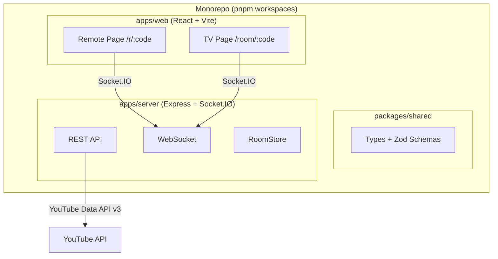

# 🎤 Karaoke Party

Ứng dụng web Karaoke sử dụng nguồn video YouTube, hỗ trợ nhiều người tham gia qua điện thoại trong cùng mạng LAN.

## Tính năng

- 📺 **Màn hình TV (Host)**: Phát video karaoke YouTube full-screen, hiển thị hàng đợi, QR code
- 📱 **Điện thoại (Remote)**: Quét QR để vào, tìm bài trên YouTube, thêm/xoá/đổi thứ tự, điều khiển phát
- ⚡ **Realtime**: Cập nhật hàng đợi tức thì (<300ms) qua WebSocket
- 👥 **Multi-user**: Nhiều điện thoại cùng tham gia một phòng
- 🔄 **Auto-recovery**: F5 không mất phòng, tự reconnect khi mất kết nối

## Kiến trúc



## Cài đặt

### Yêu cầu

- Node.js ≥ 18
- pnpm ≥ 9

### Lấy YouTube API Key

1. Truy cập [Google Cloud Console](https://console.cloud.google.com/)
2. Tạo project mới hoặc chọn project có sẵn
3. Vào **APIs & Services** → **Library**
4. Tìm và bật **YouTube Data API v3**
5. Vào **APIs & Services** → **Credentials**
6. Bấm **Create Credentials** → **API key**
7. Copy API key

### Cấu hình

```bash
# Clone repo
git clone <repo-url>
cd karaoke

# Cài đặt dependencies
pnpm install

# Tạo file .env từ template
cp .env.example .env
```

Chỉnh sửa `.env`:

```env
PORT=3001
PUBLIC_BASE_URL=http://192.168.1.100:5173   # IP LAN của máy tính, KHÔNG dùng localhost
YOUTUBE_API_KEY=AIzaSy...                    # API key từ bước trên
CORS_ORIGIN=http://192.168.1.100:5173
SEARCH_CACHE_TTL=21600000                    # 6 giờ
```

> ⚠️ **Quan trọng**: `PUBLIC_BASE_URL` phải là địa chỉ IP LAN (ví dụ `192.168.1.x`) để điện thoại trong cùng mạng WiFi có thể truy cập. Tìm IP LAN: `ifconfig | grep "inet " | grep -v 127.0.0.1`

### Chạy Dev

```bash
pnpm dev
```

Lệnh này chạy song song:
- **Server**: http://localhost:3001
- **Web**: http://localhost:5173 (có proxy tới server)

### Truy cập từ điện thoại

1. Đảm bảo máy tính và điện thoại cùng mạng WiFi
2. Mở trình duyệt trên máy tính: `http://localhost:5173`
3. Bấm icon QR trên màn hình TV
4. Quét QR bằng camera điện thoại → tự động mở trang remote

## Build

```bash
pnpm build
```

## Docker

```bash
docker-compose up -d
```

## Test

```bash
# Unit tests
pnpm test

# E2E tests
pnpm test:e2e
```

## Socket.IO Events

### Client → Server

| Event | Payload | Mô tả |
|-------|---------|--------|
| `room:create` | — | Tạo phòng mới |
| `room:join` | `{ roomCode, nickname }` | Tham gia phòng |
| `queue:add` | `{ videoId, title, channelTitle, thumbnailUrl, durationSec, nickname, version }` | Thêm bài |
| `queue:remove` | `{ itemId, nickname, version }` | Xoá bài |
| `queue:reorder` | `{ itemId, newIndex, version }` | Đổi thứ tự |
| `queue:priority` | `{ itemId, version }` | Ưu tiên bài |
| `player:play` | — | Phát |
| `player:pause` | — | Tạm dừng |
| `player:next` | — | Bài tiếp |
| `player:seek` | `{ time }` | Tua đến |
| `player:volume` | `{ volume }` | Âm lượng |
| `player:state:report` | `PlayerState` | TV báo cáo trạng thái |

### Server → Client

| Event | Payload | Mô tả |
|-------|---------|--------|
| `room:state` | `RoomState` | Trạng thái phòng đầy đủ |
| `queue:updated` | `{ queue, currentIndex, version }` | Hàng đợi cập nhật |
| `player:state` | `PlayerState` | Trạng thái phát |
| `user:joined` | `UserInfo` | Người mới tham gia |
| `user:left` | `{ socketId, nickname }` | Người rời phòng |
| `error` | `{ message, code }` | Lỗi |

## REST API

| Method | Endpoint | Mô tả |
|--------|----------|--------|
| `POST` | `/api/rooms` | Tạo phòng mới |
| `GET` | `/api/rooms/:code` | Lấy thông tin phòng |
| `GET` | `/api/search?q=&karaokeOnly=true` | Tìm bài trên YouTube |
| `GET` | `/api/video/:videoId` | Lấy thông tin video |
| `GET` | `/healthz` | Health check |

## Ghi chú Quota YouTube

- **Quota mặc định**: 10,000 units/ngày
- **`search.list`**: 100 units/lần gọi → tối đa ~100 lần tìm kiếm/ngày
- **`videos.list`**: 1 unit/lần gọi
- Kết quả tìm kiếm được cache 6 giờ để tiết kiệm quota
- Khi hết quota: hiện thông báo "Hết lượt tìm kiếm hôm nay", sử dụng danh sách bài có sẵn

## Tuân thủ pháp lý

Ứng dụng này tuân thủ [YouTube API Services Terms of Service](https://developers.google.com/youtube/terms/api-services-terms-of-service):
- Chỉ nhúng video qua YouTube IFrame Player API chính thức
- **Không** tải xuống, rip, hoặc proxy luồng video YouTube
- **Không** lưu trữ nội dung video YouTube
- API key không được commit vào repository

## Tech Stack

- **Frontend**: React 18 + TypeScript + Vite + TailwindCSS + Zustand
- **Backend**: Node.js + Express + Socket.IO
- **Shared**: Zod schemas + TypeScript types
- **QR**: qrcode (SVG)
- **Drag & Drop**: @dnd-kit
- **Monorepo**: pnpm workspaces

## License

MIT
